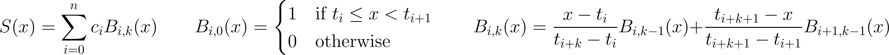

# KANditioned: Fast, Generalizable Training of KANs via Lookup Interpolation

Training is accelerated by orders of magnitude through exploiting the structure of linear (C⁰) spline with uniformly spaced control points, where spline(x) can be calculated as a linear interpolation between the two nearest control points. This is in constrast with the typical summation often seen in B-spline, reducing the amount of computation required and enabling effectively sublinear scaling across the control points dimension.

## Install

```
pip install kanditioned
```

## Usage
```
from kanditioned.kan_layer import KANLayer

layer = KANLayer(in_features=3, out_features=3, init="random_normal", num_control_points=8)
```

It is highly recommended to use this layer with torch.compile, which will provide very significant speedups. It is also highly recommended to put the number of control points as a power 

Args:
    in_features (int) – size of each input sample
    out_features (int) – size of each output sample
    init (str) — initialization method:
        "random_normal": random slopes, normalized per output.
        "identity": identity mapping (requires in_features == out_features).
        "zero": initializes all weights to zero.
    num_control_points (int) — number of discrete control points per input feature.

## How This Works

This implementation of KAN uses a linear (C⁰) spline, with uniformly spaced control points (see Figure 1).

> **Figure 1.** Linear B-spline example:  
> 

> **Equation 1.** B-spline formula:
>
> 

## Roadmap
- Update package with cleaned up, efficient Discrete Cosine Transform and parallel scan (prefix sum) reparameterizations. Both provide isotropic κ ~ O(1) discrete second difference penalty, as opposed to κ ~ O(N^4) for naive B-spline parameterization. This only matters if you care about regularization.
- Proper baselines against MLP and various other KAN implementations on backward and forward passes
- Add in feature-major variant
- Add bias, spline range, and normalization parameters
- Add optimized Triton kernel
- Clean up writing

## LICENSE
This project is licensed under the [Apache License 2.0](https://www.apache.org/licenses/LICENSE-2.0.txt).