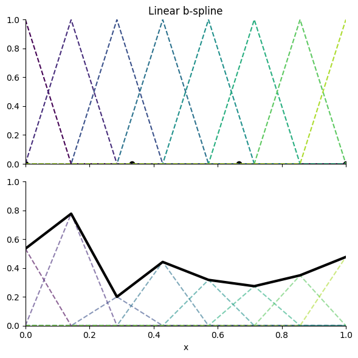

# Fast, Generalizable Training of KANs via Lookup Interpolation and Parallel Scan Reparameterization
<!-- # Fast and generalizable training of Kolmogorov-Arnold Network (KAN) via look up tables and prefix-sum reparameterization.  -->

<!-- ### TL;DR: This KAN implementation uses a linear spline with uniformly spaced control points and reparameterizes from a B-spline to a cumulative ReLU-based spline for better optimization conditioning. Training is accelerated using a parallel prefix-sum and fast interpolation via parameter lookup between the two nearest basis functions. -->

<!-- ## TL;DR: This KAN implementation achieves orders-of-magnitude faster training, improved conditioning, and better generalization by reparameterizing linear B-splines into cumulative ReLU-based splines and leveraging parallel scan and lookup-based interpolation. -->

<!-- ## TL;DR: This KAN implementation achieves orders-of-magnitude faster training and better generalization by reparameterizing linear B-splines into cumulative ReLU-based splines and leveraging parallel scan and lookup-based interpolation. -->

<!-- ### TL;DR: This KAN implementation achieves orders-of-magnitude faster training and better generalization by reparameterizing linear B-splines into cumulative ReLU-based splines. Training is accelerated via leveraging parallel scan for reparameterization and fast interpolation via parameter lookup between the two nearest basis functions. -->

<!-- ## TL;DR: This KAN implementation improves training speed by orders of magnitude, along with better conditioning and generalization, by reparameterizing linear B-splines into cumulative ReLU-based splines and using parallel scan and lookup-based interpolation. -->
 
<!-- ## TL;DR: This KAN implementation achieves orders of magnitude faster training and better generalization by reparameterizing B-splines into cumulative ReLU splines and leveraging parallel scan and lookup-based interpolation. -->

<!-- ## TL;DR: We speed up KAN training by orders of magnitude and improve generalization using a better spline formulation and fast interpolation trick. -->

## TL;DR: We accelerate KAN training by orders of magnitude and improve generalization by reparameterizing the linear spline with parallel scan and using a fast interpolation trick.

This implementation of KAN uses a linear (C⁰) spline, with uniformly spaced control points (see Figure 1). To improve the conditioning of the optimization problem, the spline is reparameterized from the B-spline basis as proposed in the original paper (see Equation 1), which has strictly local support, to a cumulative ReLU spline formulation (see Equation 2). In this formulation, each parameter contributes via a ReLU term with support extending in one direction from its associated breakpoint bl, yielding semi-global, rather than local, influence. As each parameter update causes semi-global changes in the spline shape, this biases learning towards simpler, more generalizable structure, as opposed to fragile, local representations, while preserving the same theoretical expressitivity. This reparameterization is implemented via a parallel scan (prefix sum) with O(log N) time complexity and O(N) work complexity, where N is the number of parameters, independent of batch size. For more details, see Equation 2. Training speed was further improved by orders of magnitude by exploiting the fact that under the uniformly spaced control points with linear basis spline formulation, spline(x) can be efficiently evaluated by calculating the index of the two nearest control points, gather, and linearly interpolating between them, rather than summing over all basis functions. At a certain point, scaling the number of control points do not cause any noticeable increase in computation time, as most of the time is spent waiting for the parameter gather, which is still significantly more efficient than summing over all basis functions. 

<!-- This implementation of KAN uses a linear (C⁰) spline, with uniformly spaced control points (see Figure 1). To improve the conditioning of the optimization problem, the spline is reparameterized from the B-spline basis as proposed in the original paper (see Equation 1), which has strictly local support, to a cumulative ReLU-based spline formulation (see Equation 2). In this formulation, each parameter contributes via a ReLU term with support extending in one direction from its associated breakpoint bl, yielding semi-global, rather than local, influence. This reparameterization is implemented via a parallel scan (prefix sum) with O(log N) time complexity, where N is the number of parameters, independent of batch size. Training speed was further improved by orders of magnitude by exploiting the fact that under the linear basis spline formulation, spline(x) can be efficiently calculated by looking up the parameters of the two nearest linear bases and linearly interpolating between them, rather than summing over all basis functions. -->

### Short Random Thoughts
- KAN suffers from training difficulties, which includes the training speed and the ill-conditioning of solution space
- Local support leads to ill-conditioning and exploration of high complexity solutions
- ReLU-based spline with its semi-global support, although is just theoretically as expressive as B-spline, biases learning towards simpler and more global, generalizable structures before exploring more complex solutions while B-splines do not have that property when overparameterized. Or, in other words, learning functions progressively, increasing in complexity from very simple form initially.

**(1)** Training of ReLU-based spline with 1k parameters:

<video src="training_animation_conditioned.mp4" controls></video>

**(2)** Training of linear B-spline with 1k parameters:

<video src="training_animation_ill_conditioned.mp4" controls></video>

<!-- instead of optimizing the spline under the B-spline parameterization (see Equation 1), it is reparameterized and directly optimized under the [insert ReLU formulation], where each parameter now affects the spline globally, rather than having strictly local support. The reparameterization is done using parallel scan (prefix sum) with O(log N) time complexity, where N is the number of parameters, independent of batch size. The number of computations can be further reduced by recognizing that under the linear basis spline formulation, spline(x) can be efficiently calculated by looking up the parameters of the two nearest linear bases and linearly interpolating between them. -->

### Figures
**(1)** Linear B-spline example:  

### Equations

**(1)** B-spline formulation:

**(2)** ReLU-spline formulation:

### TODO:
- Add baselines comparing ReLU-based spline, B-spline, and MLP with same number of parameters
- Add ReLU spline figure
- Add gifs or videos showing the training process with and without reparameterization
- Add the steps to go from ReLU-spline formulation to prefix-sum
- Revisit the writing to be more polished later
- Write optimized Triton kernel
- Put up Google Colab Notebooks